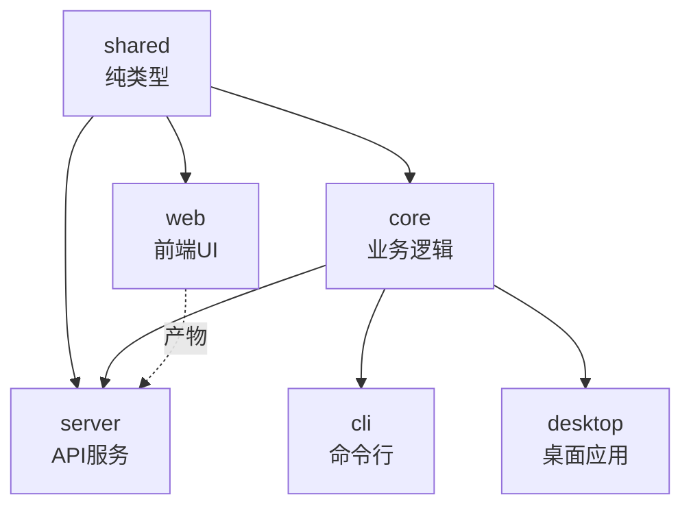

# MCP Agent 架构与依赖分析

## 📦 Monorepo 结构

```
mcp-agent/
├── packages/
│   ├── shared/          # 纯类型定义（0 runtime deps）
│   ├── core/            # 核心业务逻辑
│   ├── server/          # HTTP API 服务
│   ├── web/             # React 前端
│   ├── cli/             # 命令行工具
│   └── desktop/         # Electron 桌面应用
├── config/              # 配置文件
└── package.json         # 根 workspace 配置
```

---

## 🎯 模块职责划分

| 模块 | 职责 | 依赖 | 构建产物 |
|------|------|------|----------|
| **@mcp-agent/shared** | 跨平台类型定义（前后端共享） | 无 | TypeScript 类型 |
| **@mcp-agent/core** | MCP 协议实现、服务管理、业务逻辑 | shared | Node.js 库 |
| **@mcp-agent/server** | REST API 服务层 + 静态文件服务 | core + shared | Node.js 服务 + 前端静态文件 |
| **@mcp-agent/web** | React 前端界面 | shared | 静态 HTML/JS/CSS |
| **@mcp-agent/cli** | 命令行工具 | core | Node.js 可执行文件 |
| **@mcp-agent/desktop** | Electron 桌面应用 | core + web | 跨平台安装包 |

---

## 🔗 依赖关系图



**依赖规则**：
- ✅ `shared` 被所有模块依赖（纯类型，无运行时开销）
- ✅ `core` 依赖 `shared`，提供业务实现
- ✅ `server` 依赖 `core` + `shared`，承载 web 静态文件
- ✅ `web` 仅依赖 `shared`（轻量级，避免打包后端代码）
- ✅ `cli` / `desktop` 依赖 `core`

---

## 🏗️ 构建流程

### 1. 开发模式 (`bun run dev`)

```bash
# 根目录
bun run dev
  └─> bun run --filter @mcp-agent/server dev:full
        └─> concurrently
              ├─ server: tsx watch src/index.ts
              └─ web:    cd ../web && bun run dev
```

**特点**：
- ✅ Server 提供 API（端口 3001）
- ✅ Web 开发服务器（端口 5174）
- ✅ 热重载（HMR）
- ✅ 并行运行

### 2. 生产构建 (`bun run build:full`)

```bash
bun run build:full
  ├─ 1. bun run build:shared    # 编译 shared 类型
  ├─ 2. bun run build:core      # 编译 core 逻辑（依赖 shared）
  ├─ 3. bun run build:web       # 构建 web 前端（Vite）
  ├─ 4. bun run build:server    # 编译 server API
  │     └─> postbuild: 复制 web/dist/* → server/public/
  └─ 5. bun run copy:web        # 确保静态文件就位
```

**依赖顺序保证**：
1. ✅ `shared` 先构建（被 core/web/server 依赖）
2. ✅ `core` 在 shared 之后（用到 shared 类型）
3. ✅ `web` 独立构建（仅依赖 shared）
4. ✅ `server` 最后构建（依赖 core，并需要 web 产物）

### 3. 生产启动 (`bun run start`)

```bash
bun run start
  └─> cd packages/server && bun run start
        └─> NODE_ENV=production node dist/index.js
              ├─ 监听 3001 端口
              ├─ 提供 API (/api/*)
              ├─ 代理 MCP (/mcp/*)
              └─ 服务静态文件 (public/* → index.html)
```

---

## ✅ 最佳实践应用

### 1. **类型定义统一管理**

#### ❌ 之前（重复定义）

```typescript
// packages/shared/src/types/mcp.ts
export interface Tool { name: string; ... }

// packages/core/src/types/mcp.ts  ❌ 完全重复
export interface Tool { name: string; ... }
```

#### ✅ 现在（单一数据源）

```typescript
// packages/shared/src/types/mcp.ts
export interface Tool { name: string; ... }

// packages/core/src/types/mcp.ts  ✅ 复用 + 扩展
export * from '@mcp-agent/shared';
export interface IMCPService { /* core 独有 */ }
```

**优点**：
- ✅ 避免版本不一致
- ✅ 减少维护成本
- ✅ 前端包体积更小（web 不需要 core 的重型依赖）

---

### 2. **构建脚本职责清晰**

#### ❌ 之前（上下文混乱）

```json
// packages/server/package.json
{
  "build:full": "npm run build && cd ../web && npm run build && npm run copy:web"
  //                                 ^^^^^^ 切换目录 ^^^^^^ 找不到 copy:web
}
```

#### ✅ 现在（职责分离）

```json
// 根目录 package.json（统一管理）
{
  "build:full": "bun run build:shared && ... && bun run copy:web",
  "copy:web": "mkdir -p packages/server/public && cp ..."
}

// packages/server/package.json（简化）
{
  "build": "tsc",
  "postbuild": "mkdir -p public && cp -r ../web/dist/* public/"  // 自动触发
}
```

**优点**：
- ✅ 不切换目录，避免上下文丢失
- ✅ 使用 workspace filter（`--filter @mcp-agent/xxx`）
- ✅ postbuild 钩子自动执行
- ✅ 一处定义，多处复用

---

### 3. **包管理器统一**

#### ❌ 之前（混用）

```json
// 根目录用 bun
"scripts": { "dev": "bun run ..." }

// 子包用 npm  ❌ 不一致
"scripts": { "dev": "npm run ..." }
```

#### ✅ 现在（统一 bun）

```json
// 所有脚本统一使用 bun
"scripts": { "dev": "bun run ..." }
"start": "bun run start"
```

---

### 4. **依赖版本管理**

#### Workspace 协议 (`workspace:*`)

```json
// packages/core/package.json
{
  "dependencies": {
    "@mcp-agent/shared": "workspace:*"  // ✅ 始终使用本地最新版本
  }
}
```

**优点**：
- ✅ 开发时自动软链接（symlink）
- ✅ 发布时自动替换为真实版本号
- ✅ 避免版本锁定问题

---

## 🚀 日常开发流程

### 首次安装

```bash
# 1. 安装所有依赖
bun install

# 2. 完整构建
bun run build:full
```

### 开发调试

```bash
# 并行启动 server + web 开发服务器
bun run dev
```

浏览器访问：
- 前端开发服务器：http://localhost:5174 (HMR)
- API 服务：http://localhost:3001

### 生产部署

```bash
# 1. 完整构建
bun run build:full

# 2. 启动生产服务器
bun run start

# 3. 访问：http://localhost:3001
```

---

## 📊 依赖实践评分

| 实践项 | 之前 | 现在 | 最佳实践 |
|--------|------|------|----------|
| **类型定义统一** | ❌ 重复 | ✅ 单一数据源 | ✅ |
| **构建脚本上下文** | ❌ cd 混乱 | ✅ workspace filter | ✅ |
| **包管理器一致性** | ❌ npm/bun 混用 | ✅ 统一 bun | ✅ |
| **依赖声明** | ✅ workspace:* | ✅ workspace:* | ✅ |
| **构建顺序** | ⚠️ 手动管理 | ✅ 显式声明 | ✅ |
| **产物复制** | ❌ 跨目录执行 | ✅ postbuild 钩子 | ✅ |
| **职责分离** | ⚠️ 混杂 | ✅ 根目录统一 | ✅ |

**总体评分**：从 **3/7** 提升到 **7/7** ✅

---

## 🔍 进一步优化建议

### 1. 使用 Turborepo/Nx（可选）

当前手动管理构建顺序，可以考虑引入构建编排工具：

```bash
# Turborepo 示例
bun add turbo -Dw
```

```json
// turbo.json
{
  "pipeline": {
    "build": {
      "dependsOn": ["^build"],  // 自动推断依赖顺序
      "outputs": ["dist/**"]
    }
  }
}
```

**优点**：
- ✅ 自动并行构建（无依赖关系的包）
- ✅ 增量构建（cache）
- ✅ 远程缓存（团队共享）

### 2. 添加构建验证

```json
// package.json
{
  "scripts": {
    "postbuild:full": "bun run verify:build"
  }
}
```

```bash
# scripts/verify-build.sh
#!/bin/bash
[ -f packages/server/dist/index.js ] || exit 1
[ -f packages/server/public/index.html ] || exit 1
echo "✅ Build artifacts verified"
```

### 3. 环境变量管理

```bash
# 使用 dotenv-cli 统一管理
bun add -Dw dotenv-cli

# package.json
"start": "dotenv -e .env.production -- bun run start"
```

---

## 📚 相关文档

- [Workspaces](https://bun.sh/docs/install/workspaces)
- [TypeScript Project References](https://www.typescriptlang.org/docs/handbook/project-references.html)
- [Monorepo Best Practices](https://monorepo.tools/)
