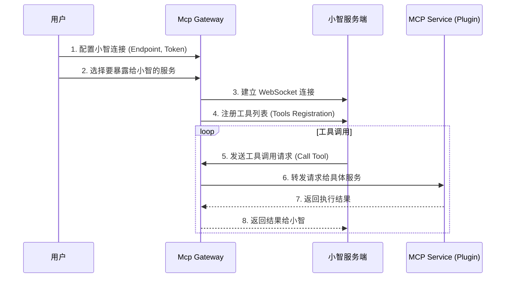
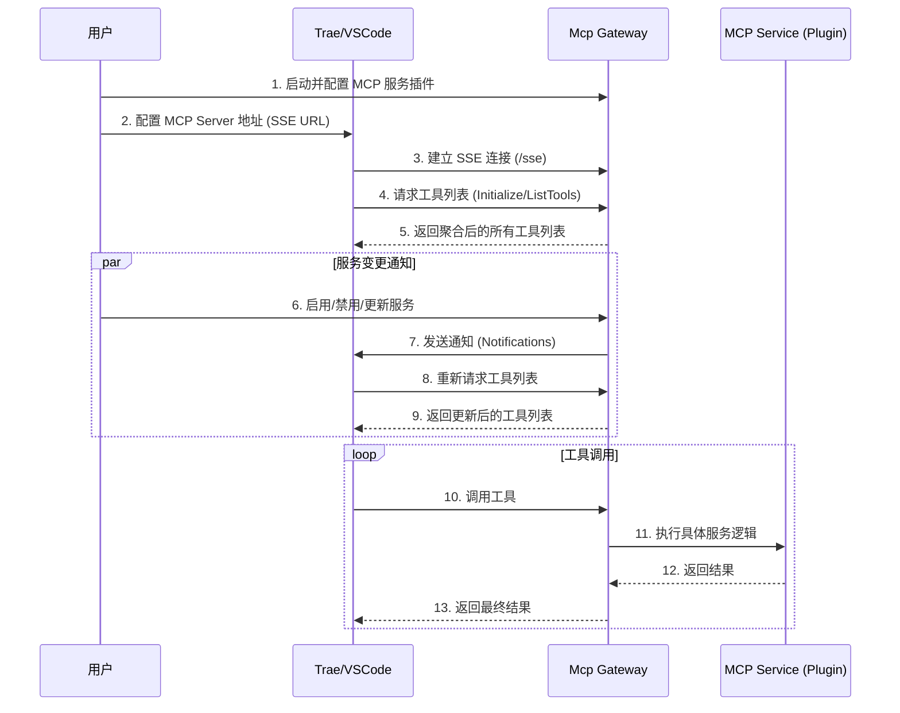

# Mcp Gateway

一个强大的 MCP (Model Context Protocol) 网关服务，用于聚合多个 MCP 服务并通过统一接口管理。支持 stdio、SSE、HTTP、Embedded 四种服务类型，提供 Web 管理界面和环境检测功能。它可以作为**小智 (XiaoZhi)** 的工具提供者，也可以作为 **Trae/VSCode** 等 MCP 客户端的聚合服务端。

[](https://hub.docker.com/r/kangkang223/mcp-gateway)
[](LICENSE)

## ✨ 核心特性

- 🔌 **多适配器支持** - stdio、embedded、sse、http 四种服务类型
- 🎨 **Web 管理界面** - 可视化配置、日志查看、环境检测
- 🔌 **插件市场** - 浏览并安装丰富的 MCP 插件生态
- 🔄 **动态服务管理** - 运行时加载/卸载，无需重启
- 🛠️ **环境检测** - 自动检测并管理 Node、Python、Rust、Java、Go 等运行时
- 🔐 **身份认证** - 可选的登录认证保护
- 🐳 **多平台 Docker** - 支持 AMD64 和 ARM64 架构
- 🤖 **小智接入** - 支持接入小智 AI 助手，提供工具能力
- 📦 **MCP 聚合** - 将多个 MCP 服务聚合为一个端点，供 Trae/VSCode 使用

## ⚠️ 免责声明 (Disclaimer)

本软件可能会通过第三方来源（如 **mcpworld**）获取、推荐或安装插件/扩展。

1.  **数据来源**：本软件中展示的部分插件信息可能来源于 **mcpworld** 或其他第三方社区。
2.  **安全性**：作者不对第三方插件的安全性、稳定性或功能性做任何保证。使用这些插件产生的风险（如数据丢失、系统不稳定等）由用户自行承担。
3.  **非商业用途**：本软件仅供个人非商业用途使用。严禁将本软件用于任何商业目的（包括但不限于销售、作为付费服务的一部分等）。商业使用请联系作者获取授权。

详细条款请参阅 [LICENSE](LICENSE) 文件。

## 🧠 核心交互流程

### 1. 小智 (XiaoZhi) 交互流程

Mcp Gateway 可以作为工具提供方接入小智，让小智具备调用本地或远程工具的能力。



### 2. MCP 聚合服务与客户端 (Trae/VSCode) 交互流程

Mcp Gateway 可以作为一个标准的 MCP Server，聚合管理多个子 MCP 服务，供支持 MCP 协议的客户端（如 Trae IDE, VSCode, Claude Desktop）使用。



## 🚀 快速开始

### Docker 部署（推荐）

```bash
# 使用 Docker Compose
docker-compose up -d

# 或使用 Docker 命令
docker run -d -p 3000:3000 kangkang223/mcp-gateway:latest

# 访问 Web 界面
open http://localhost:3000
```

### 开发模式

```bash
# 安装依赖
bun install

# 启动开发环境（API Server + Web 界面）
bun run dev

# 访问 Web 界面
open http://localhost:5174
```

## 📖 详细使用指南

### 第一步：启动服务

参考上述 [快速开始](#-快速开始) 部分启动 Mcp Gateway。启动成功后，访问 Web 管理界面（默认 http://localhost:3000 或开发环境的 http://localhost:5174）。

### 第二步：浏览与安装插件 (Plugin Marketplace)

1.  **进入插件市场**：点击顶部导航栏的 **"插件市场" (Market)**。
2.  **浏览插件**：查看推荐的 MCP 插件列表，点击插件卡片查看详情。
3.  **解析配置**：点击卡片后，系统会自动解析该插件是否支持当前环境安装。如果支持（即存在可用的安装配置），界面上会显示 **"安装服务"** 按钮。
4.  **安装服务**：点击 **"安装服务"** 按钮，该插件会被添加到服务列表中（此时处于停止状态）。

### 第三步：管理与启动服务 (Service Management)

1.  **进入服务管理**：点击顶部导航栏的 **"服务管理" (Services)**。
2.  **启动服务**：找到刚刚安装的服务，点击 **"启动"** 图标（播放按钮）。只有启动成功的服务才能被外部使用。
3.  **服务控制**：
    *   **编辑配置**：点击编辑图标（铅笔）修改服务参数、环境变量等。
    *   **删除服务**：点击删除图标（垃圾桶）移除服务。
4.  **添加自定义服务**：除了从市场安装，你也可以点击右上角的 **"+ 添加服务"** 按钮，手动配置 stdio 命令或 SSE/HTTP URL。
5.  **导入配置**：支持导入 Claude Desktop / VS Code 的 `config.json` 配置文件。

### 第四步：连接管理 (Connection Management)

服务启动后，需要将其绑定到对应的连接端点才能使用。

1.  **进入连接管理**：点击顶部导航栏的 **"连接管理" (Connection)**。
2.  **小智 (XiaoZhi) 接入**：
    *   **选择端点**：在下拉框中选择要使用的端点（如 "Xiaozhi 生产环境"），或点击 "添加新端点" 进行配置。
    *   **启用服务**：在 "Xiaozhi 启用服务" 区域，点击右侧的 **"⚙️ 管理服务"** 按钮。
    *   **选择服务**：在弹出的对话框中，**勾选** 刚刚启动的服务（例如 `fetch`），然后点击保存。
    *   **切换连接**：确认端点信息无误后，点击 **"🔄 切换连接"** 按钮，Gateway 会尝试连接到选定的端点。
3.  **MCP 聚合服务 (MCP Proxy)**：
    *   **启用服务**：在 "MCP 聚合服务" 区域，同样点击 **"⚙️ 管理服务"** 按钮，**勾选** 希望通过 SSE 接口暴露给 Trae/VSCode 等客户端使用的服务。
    *   **SSE 地址**：页面会显示当前的 SSE 服务地址（通常为 `http://localhost:3000/sse`）。

### 第五步：配置 MCP 客户端 (Trae/VSCode)

在 IDE 中使用聚合后的 MCP 工具。

**对于 Trae IDE / VSCode:**

1.  **获取 SSE 地址**：从 "连接管理" 页面获取 SSE 地址。
2.  **配置客户端**：
    *   打开 Trae/VSCode 的设置或配置文件。
    *   添加一个新的 MCP Server。
    *   类型选择 `sse`。
    *   URL 填入 `http://localhost:3000/sse`。
3.  **验证连接**：
    *   保存配置后，IDE 通常会提示 "MCP Server Connected"。
    *   在 IDE 的工具列表或对话框中，你应该能看到所有在 "连接管理" 中勾选并启用的服务工具。
4.  **动态更新**：
    *   当你在 Mcp Gateway 中添加、删除或重新配置服务后，Trae/VSCode 会自动收到通知并刷新工具列表，无需重启 IDE。

## 📋 功能使用说明

### 1. 服务管理
- **添加服务**：支持通过 Web 界面添加多种类型的 MCP 服务。
- **配置编辑**：可编辑服务的命令、参数、环境变量等配置。
- **状态控制**：一键启动、停止、重启服务。
- **日志监控**：实时查看服务的标准输出和错误日志，便于调试。
- **导入配置**：支持导入 Claude Desktop / VS Code 的 MCP 配置文件。

### 2. 环境检测与管理
- **运行时检测**：自动检测系统中安装的 Node.js、Python、Rust、Java、Go 等环境版本。
- **包管理器支持**：识别 npm、pip、cargo 等包管理器状态。
- **一键安装**：支持在界面上一键安装缺失的运行时环境（依赖于底层系统支持）。

### 3. 配置管理
- **可视化编辑**：提供 JSON 配置的可视化编辑器。
- **热重载**：配置修改后自动应用，无需重启 Agent。
- **持久化**：服务配置和运行状态会自动保存。

## 🔐 安全配置（登录认证）

Mcp Gateway 支持 Web UI 登录认证保护，默认关闭。启用后，访问 Web UI 需要登录。

### Docker 环境配置

编辑 `docker-compose.yml`：

```yaml
environment:
  - MCP_GATEWAY_AUTH=true    # 启用认证
  - MCP_GATEWAY_USERNAME=admin      # 设置用户名
  - MCP_GATEWAY_PASSWORD=your_secure_password  # 设置密码
```

### 开发环境配置

创建 `.env` 文件（参考 `.env.example`）：

```bash
# 启用登录认证
MCP_GATEWAY_AUTHE=true

# 设置用户名和密码
MCP_GATEWAY_USERNAME=admin
MCP_GATEWAY_PASSWORD=your_secure_password
```

⚠️ **安全提示**：
- 生产环境请务必修改默认密码
- 使用强密码（建议至少 12 位，包含大小写字母、数字和特殊字符）
- 建议配合 HTTPS 使用以保护传输过程中的凭据

## 📖 相关文档

- [Docker 部署指南](./docs/DOCKER.md) - 详细的 Docker 部署说明
- [开发者指南](./docs/DEVELOPMENT.md) - 开发环境搭建与调试
- [架构设计](./ARCHITECTURE.md) - 系统架构说明

## 🛠️ 常用命令

```bash
# 本地开发
bun run dev              # 启动 API+Web 开发环境

# 构建
bun run build            # 构建所有包

# Docker
make build               # 构建 Docker 镜像
make up                  # 启动服务
make logs                # 查看日志
```

## 🤝 贡献

欢迎提交 Issue 和 Pull Request！

## 📄 许可证

本项目采用自定义许可证。

- **个人非商业用途**：免费使用。
- **商业用途**：禁止（需获得授权）。
- **第三方插件**：本软件可能包含或推荐来自 **mcpworld** 的插件，作者不对这些插件的安全性负责。

详见 [LICENSE](LICENSE) 文件。

---

**相关链接**：
- 🐳 [Docker Hub](https://hub.docker.com/r/kangkang223/mcp-gateway)
